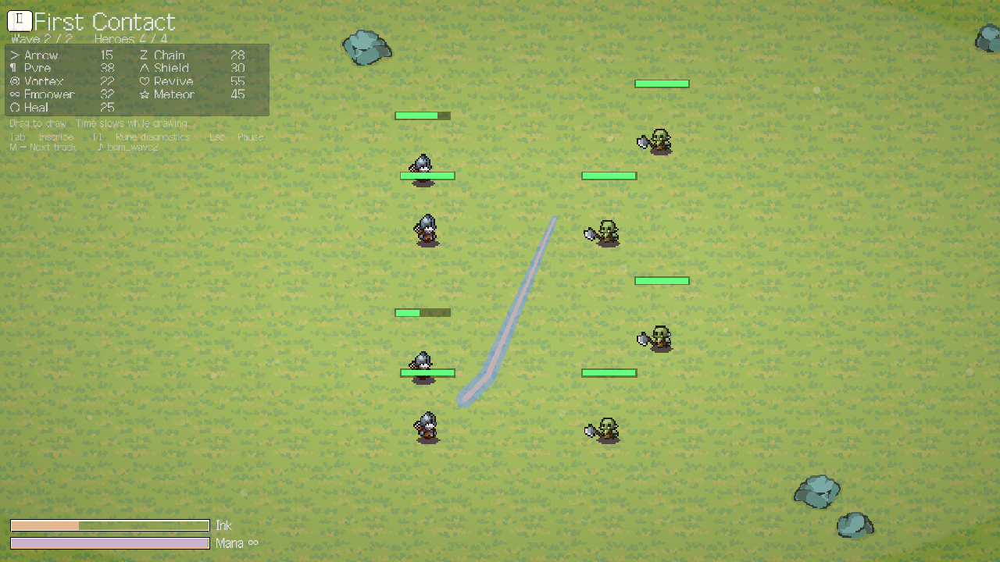

# RuneCast

손으로 도형을 그려 룬을 시전하는 실시간 제스처 + 오토배틀러.
Unity 6 (6000.4.2f1) · C# · 1인 개발.

**플레이: https://8rulerstar.itch.io/runecast**

> 영웅들은 알아서 싸운다. 당신은 싸우지 않는다 — 그린다.
> 화면에 쐐기, 나선, 별을 그으면 그게 전투로 날아간다. 유닛을 움직이거나
> 대상을 고르는 일은 없다. 그리는 것이 개입의 전부다.



---

## 이 저장소에 대하여

**코드와 설계 문서만 있는 저장소입니다.** 게임에 쓰인 아트·사운드 에셋은
제3자 라이선스(대부분 "게임 번들 가능 / 재배포 금지")라 포함하지 않았습니다.
따라서 이 저장소를 클론해도 빌드되지 않습니다 — 실제 게임은 위 itch 링크에서
받으실 수 있습니다.

읽는 저장소로 만든 것이라, 봐 주셨으면 하는 건 코드와 그 아래 문서들입니다.

| 경로 | 무엇 |
|---|---|
| `Assets/Scripts/` | C# 94개. 씬 없이 `Core/Bootstrap.cs`가 전부 코드로 조립한다 |
| `tools/` | 파이썬 검사기·전투 시뮬레이터 11개. 에디터를 안 켜고 확인하는 도구들 |
| `docs/DESIGN.md` | 설계 문서. 모든 수치에 정의된 `파일:라인`을 붙였다 |
| `docs/DEVLOG.md` | 개발 기록 — 무엇을 왜 그렇게 만들었는지 |
| `docs/WORKING-NOTES.md` | 이 프로젝트에서 실제로 나온 실수와 그 대응 |
| `docs/CREDITS.md` | 에셋 출처와 가공 내역 |

## 코드 구조

```
Assets/Scripts/
├─ Core/     (22)  Bootstrap, AudioManager, BurstFx, PrimitiveSprites …
├─ Battle/   (14)  유닛·AI·투사체, 보스 패턴, 상태이상
├─ Gesture/  (11)  획 입력 → 도형 인식 → 정확도 채점
├─ Runes/    (12)  아홉 룬의 효과
├─ Meta/     (18)  스테이지, 뽑기, 업적, 저장
└─ UI/       (17)  IMGUI 기반 화면 전부
```

### 읽을 만한 곳

- **`Gesture/`** — 손으로 그린 획을 아홉 도형 중 하나로 판정하고, 얼마나 정확히
  그렸는지 GOOD/GREAT/EXCELLENT/PERFECT로 채점한다. 이 게임의 핵심 장치.
- **`Core/Bootstrap.cs`** — 씬 파일이 없다. 모든 오브젝트를 코드로 조립한다.
  머지 충돌이 없고 diff로 변경을 읽을 수 있다.
- **`Core/PrimitiveSprites.cs`** — 체력바·보호막 링 같은 것은 이미지 파일이 아니라
  런타임에 텍스처로 찍어낸다.
- **`tools/sim_battle.py`, `tools/sim_player.py`** — 밸런스를 감으로 잡지 않기 위한
  시뮬레이터. 12판 전체를 돌려 표로 뽑는다. 요소를 껐다 켜서 숫자가 안 달라지면
  그 요소는 실제로 작동하지 않는 것이다 — 이 방식으로 잡은 버그들이
  `docs/WORKING-NOTES.md`에 적혀 있다.

## 아홉 룬

| 도형 | 룬 | |
|---|---|---|
| 쐐기 `>` | 화살 | 그린 방향으로 일제사격 |
| 원 `○` | 회복 | 원 안의 아군 전부 |
| 삼각형 `△` | 보호막 | 감싼 아군에게 barrier |
| 지그재그 `Z` | 연쇄 번개 | 적을 타고 넘으며 약해진다 |
| 나선 `◎` | 소용돌이 | 끌어모은다 — 피해는 없다 |
| 별 `☆` | 별똥별 | 예고 후 그 아래 전부 |
| 깃발 | 고양 | 아군이 더 세게, 더 빠르게 |
| 하트 | 소생 | 쓰러진 영웅을 되살린다 |
| 무한대 | 봉화 | 계속 타는 불의 고리 |

마나는 **얼마나 자주** 개입할지를, 잉크는 **얼마나 크게** 그릴지를 제한한다.

## 라이선스

코드(`Assets/Scripts/`, `tools/`)는 MIT. 자세한 것은 [LICENSE](LICENSE).

에셋은 이 저장소에 없습니다. 게임에 쓰인 에셋의 출처와 라이선스는
[docs/CREDITS.md](docs/CREDITS.md)에 정리돼 있으며, 그중 표기 의무가 있는
**Complete UI Essential Pack (Crusenho Agus Hennihuno, CC BY 4.0)** 은
게임 내 크레딧 화면에 표기돼 있습니다.
